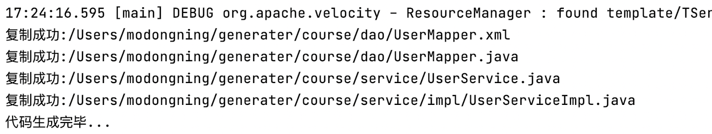

# 代码生产器
通过自定义注解，自动生成代码：controller，service，mapper，mapper.xml，实体Markdown的md文件

## 添加依赖
```xml
<dependency>
    <groupId>com.otoomo</groupId>
    <artifactId>code-generater</artifactId>
    <version>0.0.0</version>
</dependency>
```

## 定义User实体
```java
@XGenModel(comment = "用户")
public class User implements Serializable {
    @XGenField(comment = "ID", key = true, uniqueKey = true)
    private Long id;
    @XGenField(comment = "用户编号", notNull = true, query = true)
    private Long userCode;
    @XGenField(comment = "用户名称", length = 40, notNull = true, query = true)
    private String userName;
    @XGenField(comment = "openid", length = 50, notNull = true)
    private String openid;
    @XGenField(comment = "头像", length = 200)
    private String headImgUrl;
    @XGenField(comment = "最后登录IP", length = 30)
    private String lastLoginIp;
    @XGenField(comment = "最后登录时间")
    private Date lastLoginTime;

    @XGenField(comment = "状态", notNull = true, length = 2,
            componentType = ComponentType.SELECT,
            query = true, def = Default.DEFAULT_INT_ONE,
            enumData = {
                    @EnumData(key = "0", value = "失效"),
                    @EnumData(key = "1", value = "可用")
            })
    private Integer status;
    @XGenField(comment = "删除状态", notNull = true, length = 2,
            componentType = ComponentType.SELECT,
            query = true, def = Default.DEFAULT_INT_ZERO,
            enumData = {
                    @EnumData(key = "0", value = "未删除"),
                    @EnumData(key = "1", value = "已删除")
            })
    private Integer delStatus;
    @XGenField(comment = "创建时间")
    private Long createTime;
    @XGenField(comment = "编辑时间")
    private Long editTime;
}
```

## 根据User自动生成代码+自动创建数据库表
```java
public class CodeGenerator {
	public static void main(String[] args) {

		String driver = "com.mysql.jdbc.Driver";
		String dbHost = "127.0.0.1";
		String dbPort = "";
		String dbName = "test";
		String userName = "root";
		String pwd = "123456";

		GenerateConfig gconf = new GenerateConfig();
		//生成controller
		gconf.genController();
		//生成service
		gconf.genService();
		//生成mapper.java + mapper.xml
		gconf.genMapper();
		//生成后台管理系统模板增删改查页面		
		gconf.genStatic();
		//生成实体md文件
		gconf.genBeanMd();
		//生成数据库表
		gconf.genTable();

		MysqlDBInfo db = new MysqlDBInfo();
		db.setDriver(driver);
		db.setDbHost(dbHost);
		db.setDbName(dbName);
		db.setDbPort(dbPort);
		db.setUserName(userName);
		db.setPassword(pwd);

		//代码生成的路径
		String path = "/Users/modongning/generater/course";

		//开始代码生成
		CodeGenerater cg = new CodeGenerater();
		cg.generateCode(User.class, gconf, db, path, path);
	}
}
```

## 复制生成的代码到项目

生成的路径



## template代码模板的static相关的后台管理系统案例，后续再开放出来
